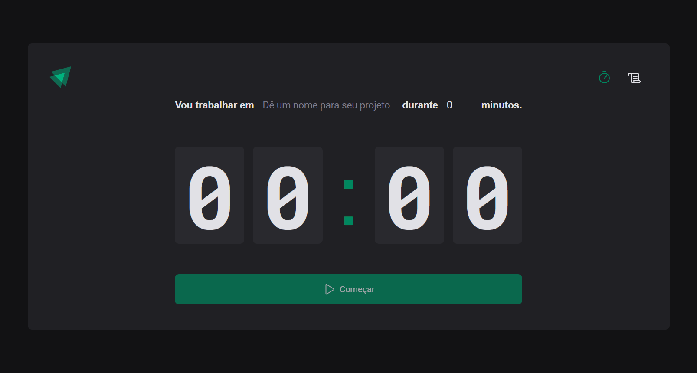
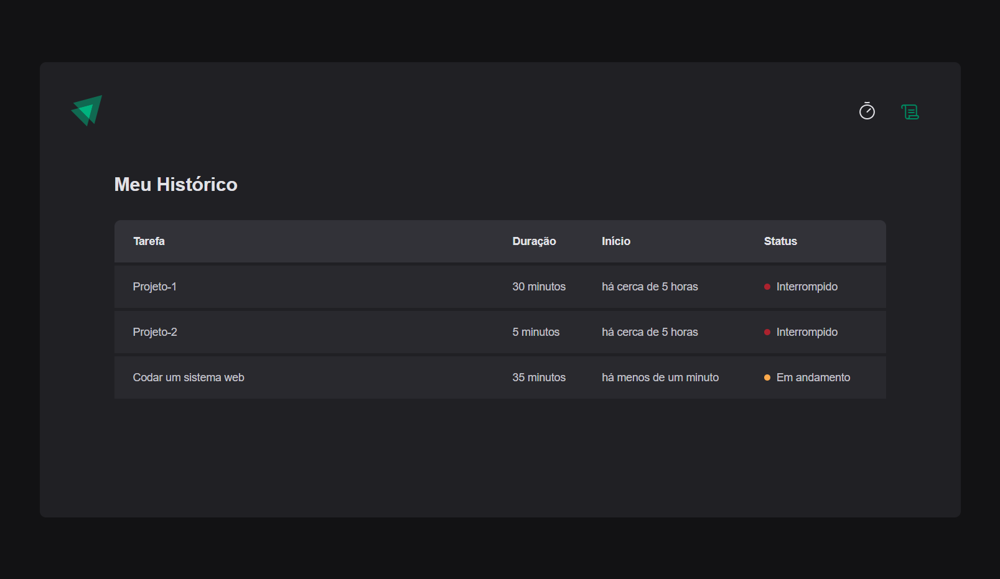

# Ignite Timer Rocketseat

    
    

    

> Trilha Ignite

Segunda aplicação desenvolvida na trilha Ignite da Rocketseat com ReactJS, Styled-Components e TypeScript

Second application developed on Rocketseat's Ignite track with ReactJS, Styled-Components and TypeScript

## 🛠 Technologies

- React
- React-Router-Dom
- TypeScript
- Styled-Components

## 🧑‍💻 Applications

- React Hooks
- React Router
- Reducers
- Context API
- immutability
- Components
- Typing with typescript
- Styled-Components

## 💛 Contact

- Email --> luca.boer@outlook.com
- Linkedin --> https://www.linkedin.com/in/luca-destefano-boer-99674121b/
